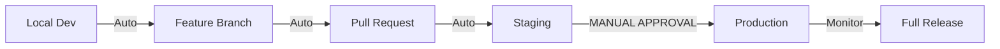

# DEPLOYMENT APPROVAL WORKFLOW

## 🛡️ CRITICAL: Production Deployment Protocol

**ABSOLUTE RULE**: NO production deployment without explicit CEO/Founder approval

## Deployment Pipeline Stages



## Stage 1: Local Development (No Approval Needed)

### Developer Actions
- Feature implementation
- Unit testing
- Code commit to feature branch

### Automated Checks
- Linting passes
- Unit tests pass (>80% coverage)
- Build succeeds
- Security scan (no high/critical issues)

### Exit Criteria
✅ All automated checks pass
✅ Code review approved by peer

---

## Stage 2: Staging Deployment (Team Approval)

### Prerequisites
- PR approved and merged to main/develop
- All CI checks passed

### Approval Required From
- **Project Delivery Manager**: Confirms readiness
- **QA Engineer**: Testing complete
- **Product Manager**: Feature meets requirements

### Staging Checklist
```markdown
- [ ] Feature complete per acceptance criteria
- [ ] All tests passing (unit, integration, E2E)
- [ ] Performance benchmarks met
- [ ] Security scan clean
- [ ] Documentation updated
- [ ] Database migrations tested
- [ ] Rollback plan documented
```

### Staging Validation (24-48 hours)
- Full regression testing
- User acceptance testing
- Performance testing
- Security audit
- Cross-browser testing

---

## Stage 3: Production Approval (CEO/Founder Required)

### 🔴 STOP: Manual Approval Gate

### Production Readiness Checklist

#### Business Validation
- [ ] Product Manager sign-off on features
- [ ] Customer impact assessed
- [ ] Communication plan ready
- [ ] Support team briefed

#### Technical Validation
- [ ] Zero P0/P1 bugs in staging
- [ ] Performance metrics within SLA
- [ ] Security vulnerabilities addressed
- [ ] Monitoring alerts configured
- [ ] Backup completed

#### Risk Assessment
- [ ] Rollback procedure tested
- [ ] Peak traffic time avoided
- [ ] Dependencies identified
- [ ] Team availability confirmed

### Approval Request Format

```markdown
To: CEO/Founder
Subject: [APPROVAL REQUIRED] Production Deployment - [Project/Feature Name]

## Deployment Summary
**Version**: v2.3.4
**Release Date/Time**: 2025-01-15 10:00 AM PST
**Risk Level**: Low/Medium/High
**Rollback Time**: < 5 minutes

## What's Changing
- Feature 1: [Description]
- Feature 2: [Description]
- Bug fixes: [Count and severity]

## Business Impact
- Expected user benefit: [Description]
- Revenue impact: [Estimate]
- Risk to users: [Assessment]

## Validation Complete
✅ Staging testing: 48 hours, 0 critical issues
✅ QA sign-off: [Name, Date]
✅ Product sign-off: [Name, Date]
✅ Security review: Passed

## Metrics to Monitor
- Error rate (threshold: <0.1%)
- Response time (threshold: <300ms)
- Conversion rate (expected: stable or improving)

## Rollback Plan
One-click rollback available via:
- GitHub Actions workflow
- Previous version: v2.3.3 (stable for 30 days)

## Team on Standby
- Project Delivery Manager: [Name]
- DevOps Engineer: [Name]
- Lead Developer: [Name]

**Approval Options:**
[ ] Approved - Deploy as planned
[ ] Approved with conditions - [Specify conditions]
[ ] Postponed - [Specify reason and new date]
[ ] Rejected - [Specify concerns]

Signature: _________________
Date: _________________
```

---

## Stage 4: Production Deployment

### Pre-Deployment (T-30 minutes)
- [ ] Final staging smoke test
- [ ] Team availability confirmed
- [ ] Monitoring dashboard open
- [ ] Rollback procedure reviewed
- [ ] Customer support notified

### Deployment Execution
1. **Canary Release (5% traffic)** - 30 minutes
   - Monitor error rates
   - Check performance metrics
   - Verify functionality

2. **Progressive Rollout**
   - 25% traffic - 1 hour monitoring
   - 50% traffic - 1 hour monitoring
   - 100% traffic - 2 hours active monitoring

### Success Criteria
- Error rate < 0.1%
- Response time < 300ms p95
- No P0/P1 incidents
- Positive user feedback

### Rollback Triggers (Automatic)
- Error rate > 1%
- Response time > 1 second
- Database connection failures
- 500 errors > 10 per minute

---

## Stage 5: Post-Deployment

### Immediate (T+2 hours)
- [ ] Deployment success notification sent
- [ ] Key metrics dashboard review
- [ ] Customer feedback monitored
- [ ] Support ticket review

### Next Day (T+24 hours)
- [ ] Metrics analysis report
- [ ] Bug triage (if any)
- [ ] Performance review
- [ ] User feedback summary

### Sprint Retrospective
- [ ] What went well?
- [ ] What could improve?
- [ ] Action items for next release
- [ ] Documentation updates

---

## Emergency Procedures

### Production Incident During Deployment

#### Severity Definitions
- **P0**: Complete outage - Rollback immediately
- **P1**: Major feature broken - Rollback within 15 min
- **P2**: Degraded performance - Fix forward or rollback
- **P3**: Minor issue - Fix in next release

#### Incident Commander Chain
1. Project Delivery Manager (primary)
2. DevOps Engineer (technical lead)
3. CEO/Founder (business decisions)

#### Communication Protocol
```
T+0: Incident detected
T+5min: Team assembled, assessment begun
T+10min: Decision made (fix/rollback)
T+15min: Customer communication sent
T+30min: Resolution implemented
T+24hr: Post-mortem completed
```

---

## Approval Matrix

| Stage | Approver | Conditions | Can Override |
|-------|----------|------------|--------------|
| Local → Feature | Developer | Tests pass | No |
| Feature → Staging | Team Lead | Code review | No |
| Staging Validation | QA + PM + PDM | All criteria met | No |
| **Staging → Production** | **CEO/Founder** | **Business ready** | **Yes (emergency)** |
| Rollback Decision | PDM or DevOps | Metrics breach | Yes (immediate) |

---

## Special Circumstances

### Hotfix Process (Critical Bugs)
1. Create hotfix branch from production
2. Implement fix with tests
3. Deploy to staging (abbreviated testing)
4. **CEO approval still required** (expedited)
5. Deploy to production
6. Monitor closely

### Security Patches
- **Critical**: Deploy immediately with CEO notification
- **High**: Deploy within 24 hours with approval
- **Medium**: Include in next regular release
- **Low**: Backlog for future sprints

### Database Migrations
- Require additional DBA review
- Must have rollback script
- Run during maintenance window
- Extra monitoring period (4 hours)

---

## Compliance & Audit Trail

### Required Documentation
- [ ] Approval emails/signatures
- [ ] Deployment logs
- [ ] Test results
- [ ] Rollback procedures
- [ ] Incident reports (if any)

### Retention Policy
- Approval records: 2 years
- Deployment logs: 90 days
- Test results: 30 days
- Incident reports: 1 year

---

## Tools & Automation

### Deployment Tools
- **CI/CD**: GitHub Actions
- **Staging**: Netlify (frontend), Render (backend)
- **Production**: Netlify (frontend), Render (backend)
- **Monitoring**: Datadog, Sentry
- **Communication**: Slack, Email

### Automated Notifications
```yaml
Deployment Started:
  - Slack: #deployments channel
  - Email: Team distribution list

Deployment Complete:
  - Slack: #general channel
  - Email: Stakeholders
  - Dashboard: Update status

Deployment Failed:
  - Slack: @here in #incidents
  - Email: On-call engineer
  - Phone: If P0 incident
```

---

## Key Contacts

| Role | Name | Contact | Availability |
|------|------|---------|--------------|
| CEO/Founder | [Name] | [Email/Phone] | Business hours |
| Project Delivery Manager | [Name] | [Email/Phone] | On-call |
| DevOps Lead | [Name] | [Email/Phone] | On-call |
| QA Lead | [Name] | [Email/Phone] | Business hours |
| Customer Support | [Name] | [Email/Phone] | 24/7 |

---

## Golden Rules

1. **Never deploy on Friday** (unless critical hotfix)
2. **Always have a rollback plan** (tested and ready)
3. **Monitor for 2 hours minimum** (active watching)
4. **Communicate early and often** (over-communicate)
5. **Document everything** (CYA principle)
6. **When in doubt, don't deploy** (better safe than sorry)

---

*Last Updated: [Current Date]*
*Version: 1.0*
*Owner: Project Delivery Manager*

**Remember: Production is sacred. Every deployment should be boring, predictable, and reversible.**