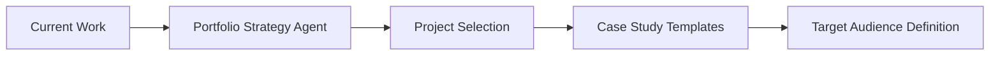
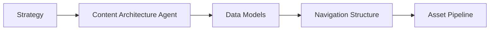
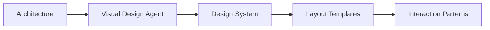
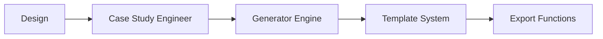
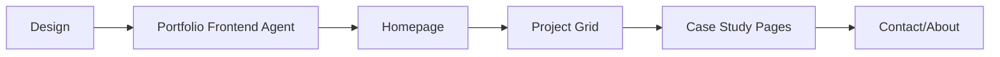
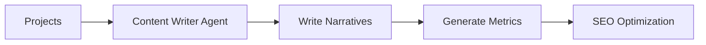

# UX Portfolio Agent Framework
## Multi-Agent System for Portfolio & Case Study Generation

---

## 🎯 Project Overview

The UX Portfolio project is a **hybrid system** combining:
1. **Static Portfolio Site** - Professional UX portfolio (HTML/CSS)
2. **Case Study Generator** - Next.js tool for creating detailed case studies
3. **Automated Publishing** - Deploy generated content to portfolio

---

## 🤖 Specialized Agent Roster for Portfolio

### Core Portfolio Agents

#### 1. **Portfolio Strategy Agent** (Adapted Product Manager)
**Role:** Define portfolio goals and case study requirements
- **Responsibilities:**
  - Analyze UX/UI trends and hiring manager expectations
  - Define case study templates and structures
  - Prioritize which projects to showcase
  - Create compelling narratives for each project
- **Outputs:**
  - `portfolio_strategy.md` - Overall portfolio vision
  - `case_study_templates.md` - Reusable formats
  - `project_selection_criteria.md` - What makes a good case study

#### 2. **Content Architecture Agent** (Adapted System Architect)
**Role:** Structure portfolio and case study data flow
- **Responsibilities:**
  - Design case study data models
  - Plan content management system
  - Define image optimization pipeline
  - Structure portfolio navigation
- **Outputs:**
  - `content_architecture.md` - Data structures
  - `navigation_flow.md` - User journey through portfolio
  - `asset_pipeline.md` - Image/video handling

#### 3. **Visual Design Agent** (Enhanced UX/UI Designer)
**Role:** Create cohesive visual system for portfolio
- **Responsibilities:**
  - Design portfolio layouts and grids
  - Create case study presentation templates
  - Define animation and interaction patterns
  - Ensure responsive design across devices
- **Outputs:**
  - `design_system.md` - Colors, typography, spacing
  - `layout_templates.md` - Grid systems
  - `interaction_patterns.md` - Hover states, transitions
  - `case_study_layouts.md` - Visual templates

#### 4. **Case Study Engineer Agent** (Specialized Backend)
**Role:** Build case study generation engine
- **Responsibilities:**
  - Implement case study data processing
  - Create template rendering system
  - Build export functionality (HTML, PDF)
  - Generate SEO-optimized content
- **Outputs:**
  - Case study generator API
  - Template rendering engine
  - Export utilities
  - SEO metadata generator

#### 5. **Portfolio Frontend Agent** (Specialized Frontend)
**Role:** Implement portfolio interface and interactions
- **Responsibilities:**
  - Build responsive portfolio layouts
  - Implement smooth animations
  - Create interactive case study viewers
  - Optimize performance and loading
- **Outputs:**
  - Portfolio HTML/CSS/JS
  - Interactive components
  - Image lazy loading
  - Performance optimizations

#### 6. **Content Writer Agent** (New Specialized)
**Role:** Generate compelling case study narratives
- **Responsibilities:**
  - Write project overviews and problem statements
  - Create process documentation
  - Generate impact statements and metrics
  - Craft professional project descriptions
- **Outputs:**
  - `case_studies/[project]/content.md`
  - Impact metrics and KPIs
  - Professional copywriting
  - SEO-optimized descriptions

---

## 📋 Portfolio Development Phases

### Phase 1: Portfolio Strategy (Day 1)


**Deliverables:**
- Portfolio goals and target audience (hiring managers, clients)
- Selected projects to showcase (5-8 best works)
- Case study structure templates
- Content tone and voice guidelines

### Phase 2: Content Architecture (Day 2)


**Deliverables:**
- Case study data schema
- Portfolio site structure
- Image optimization pipeline
- Content management approach

### Phase 3: Visual Design System (Day 3-4)


**Deliverables:**
- Complete design system
- Portfolio layout templates
- Case study presentation formats
- Mobile responsive designs

### Phase 4: Implementation (Day 5-10)

#### 4.1: Case Study Generator Development


#### 4.2: Portfolio Frontend Development


### Phase 5: Content Generation (Day 11-15)


---

## 🔄 Case Study Generation Pipeline

### Automated Workflow

```yaml
Input Phase:
  1. Project Assets:
     - Screenshots/mockups
     - Project brief
     - Results/metrics
     
  2. Project Metadata:
     - Client name
     - Timeline
     - Your role
     - Technologies used

Processing Phase:
  1. Content Writer Agent:
     - Generates narrative structure
     - Creates problem/solution story
     - Writes process documentation
     
  2. Visual Design Agent:
     - Selects appropriate template
     - Arranges visual hierarchy
     - Creates responsive layout
     
  3. Case Study Engineer:
     - Processes all inputs
     - Renders final HTML
     - Optimizes images
     - Generates SEO tags

Output Phase:
  1. Generated Files:
     - case-studies/[project-name].html
     - Optimized images
     - SEO metadata
     
  2. Integration:
     - Updates portfolio index
     - Adds to project grid
     - Updates navigation
```

---

## 📁 Enhanced Project Structure

```
ux-portfolio/
├── agents/                      # Agent framework
│   ├── portfolio-strategy.md
│   ├── content-architecture.md
│   ├── visual-design.md
│   ├── case-study-engineer.md
│   ├── portfolio-frontend.md
│   └── content-writer.md
├── src/
│   ├── tools/
│   │   └── case-study-generator/   # Next.js tool
│   │       ├── app/
│   │       ├── components/
│   │       └── lib/
│   ├── components/              # Reusable portfolio components
│   ├── styles/                  # Global styles
│   └── templates/               # Case study templates
├── case-studies/                # Generated case studies
│   ├── akm-secure/
│   │   ├── index.html
│   │   ├── assets/
│   │   └── data.json
│   ├── kollects-io/
│   └── mypick-io/
├── public/                      # Static assets
│   ├── resume/
│   └── images/
├── index.html                   # Portfolio homepage
└── case-study-config.yaml      # Configuration
```

---

## 🚀 Implementation Plan

### Week 1: Foundation
- [ ] Day 1: Run Portfolio Strategy Agent
- [ ] Day 2: Run Content Architecture Agent
- [ ] Day 3-4: Run Visual Design Agent
- [ ] Day 5: Review and approve all designs

### Week 2: Development
- [ ] Day 6-7: Case Study Generator implementation
- [ ] Day 8-9: Portfolio frontend development
- [ ] Day 10: Integration and testing

### Week 3: Content Creation
- [ ] Day 11-12: Generate AKM SecureKey case study
- [ ] Day 13: Generate Kollects.io case study
- [ ] Day 14: Generate MyPick.io case study
- [ ] Day 15: Final polish and deployment

---

## 📝 Agent Invocation Commands

### 1. Initialize Portfolio Strategy
```markdown
Agent: Portfolio Strategy Agent
Task: "Define portfolio strategy for UX/UI designer targeting enterprise clients and startups"

Inputs:
- Current resume
- List of completed projects
- Target job descriptions
- Industry best practices

Expected Outputs:
- Portfolio positioning statement
- 5-8 selected projects with rationale
- Case study structure template
- Success metrics
```

### 2. Design Case Study Template
```markdown
Agent: Visual Design Agent
Task: "Create reusable case study template with modern, clean aesthetic"

Inputs:
- Portfolio strategy document
- Brand guidelines
- Competitor analysis
- Device requirements (desktop, tablet, mobile)

Expected Outputs:
- Figma/Sketch files
- HTML/CSS templates
- Component library
- Animation specifications
```

### 3. Generate Case Study Content
```markdown
Agent: Content Writer Agent
Task: "Write compelling case study for [PROJECT_NAME]"

Inputs:
- Project brief
- Screenshots/designs
- Results metrics
- Target audience

Expected Outputs:
- Problem statement (200 words)
- Solution overview (300 words)
- Process documentation (500 words)
- Results & impact (200 words)
- Key takeaways (bullet points)
```

### 4. Build Generator Tool
```markdown
Agent: Case Study Engineer Agent
Task: "Implement case study generator with Next.js"

Inputs:
- Content templates
- Design specifications
- Data schema
- Export requirements

Expected Outputs:
- Working generator application
- Template rendering system
- Export functionality (HTML, PDF)
- API endpoints
```

---

## ✅ Quality Checklist

### Portfolio Quality Gates

#### Gate 1: Strategy Alignment
- [ ] Clear target audience defined
- [ ] Projects showcase diverse skills
- [ ] Consistent narrative across cases
- [ ] Professional tone maintained

#### Gate 2: Visual Excellence
- [ ] Consistent design system
- [ ] Responsive on all devices
- [ ] Fast loading times (<2s)
- [ ] Smooth animations

#### Gate 3: Content Quality
- [ ] Clear problem/solution stories
- [ ] Quantifiable results included
- [ ] Process well-documented
- [ ] No grammar/spelling errors

#### Gate 4: Technical Performance
- [ ] SEO optimized
- [ ] Accessibility compliant
- [ ] Cross-browser compatible
- [ ] Performance scores >90

---

## 🎯 Success Metrics

### Portfolio Metrics
- **Load Time:** <2 seconds
- **Lighthouse Score:** >90
- **Mobile Responsive:** 100%
- **Case Study Generation:** <5 minutes per study

### Engagement Metrics
- **Average Session Duration:** >2 minutes
- **Case Study Completion Rate:** >60%
- **Contact Form Submissions:** >5% of visitors
- **Interview Invitations:** >20% of applications

---

## 🔧 Specific Adaptations from Base Framework

### What's Different for Portfolio:

1. **Content-First Approach**
   - Unlike typical apps, portfolio is content-driven
   - Focus on narrative and visual presentation
   - SEO and performance critical

2. **Hybrid Architecture**
   - Static site for portfolio
   - Dynamic tool for generation
   - Export/import workflow

3. **Visual Priority**
   - Design leads development
   - Every pixel matters
   - Animation enhances story

4. **Specialized Agents**
   - Content Writer Agent (new)
   - Visual Design Agent (enhanced)
   - Portfolio Strategy Agent (adapted)

5. **Rapid Iteration**
   - Quick case study generation
   - Easy updates and modifications
   - Version control for content

---

## 📚 Resources & References

### Portfolio Best Practices
- [Laws of UX](https://lawsofux.com)
- [Bestfolios](https://bestfolios.com)
- [Case Study Club](https://www.casestudy.club)

### Technical Resources
- [Next.js Docs](https://nextjs.org/docs)
- [Tailwind CSS](https://tailwindcss.com)
- [Framer Motion](https://www.framer.com/motion)

### Content Guidelines
- [UX Writing Hub](https://uxwritinghub.com)
- [Nielsen Norman Group](https://www.nngroup.com)

---

## 🚀 Next Steps

1. **Review existing portfolio** (index.html) for reusable components
2. **Audit current case studies** for content patterns
3. **Run Portfolio Strategy Agent** to define direction
4. **Begin systematic implementation** following phases

---

*Framework Version: 1.0 - Portfolio Specific*  
*Created: [Current Date]*  
*Project: UX Portfolio & Case Study Generator*